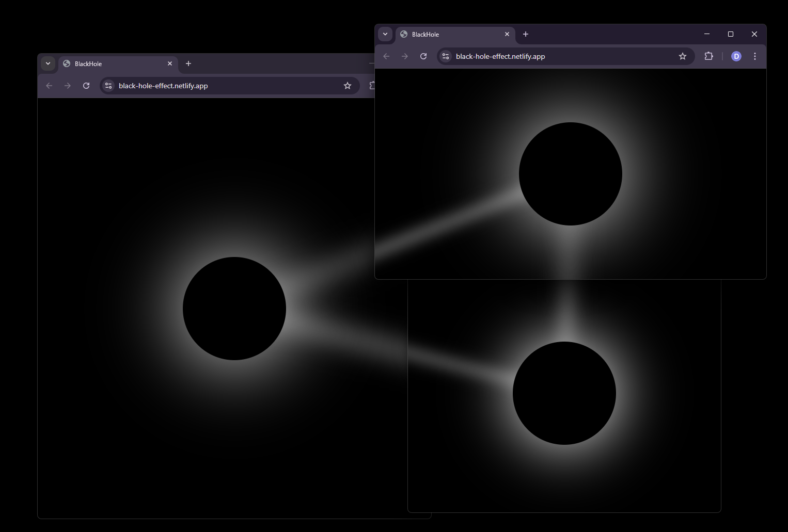

# BlackHole



# What is it?

This is a website with a black hole effect, where a line is formed between them when a new window is added.

# Quick Start

The website can be accessed at https://black-hole-effect.vercel.app

# Source Code

1. Clone the repository:

```
git clone https://github.com/sh4man4ik/BlackHole.git
```

2. Go to the directory:

```
cd BlackHole
```

3. Download the dependencies:

```
npm install
```

4. Launch the website:

```
npm run dev
```

# Tech stack

The following technologies are used to develop the website: **JavaScript**, **HTML**, **CSS**, **Vite** and **Node.js**.

# Facts about the website

- The website features beautiful animations
- You can open as many as you want and move them around as you like, and the lines will always follow the centers of the
  others
